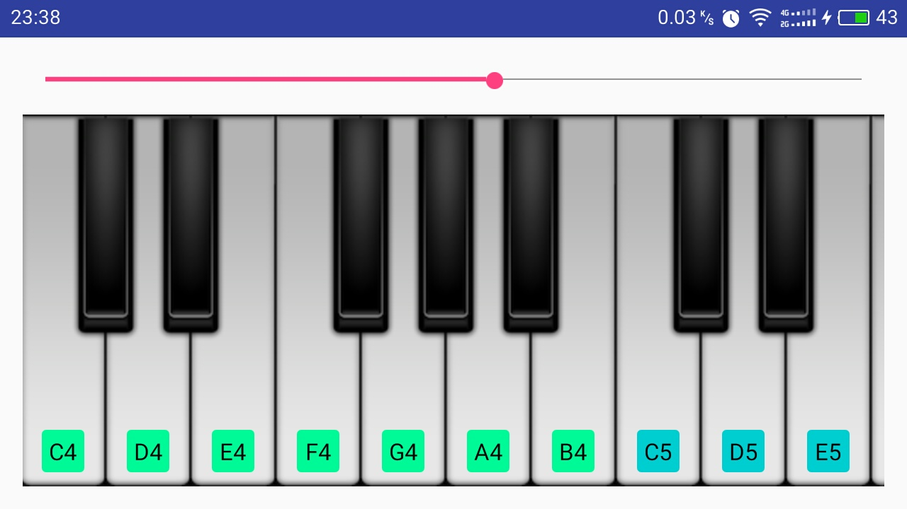

# PianoView

A custom view on Android,which can help you easily to create a piano on Android.

## Features
- Beautiful UI
- Good flexibility,which can use in different devices and layout.
- Two interface,which can help user to use this view better.
- Mutil-Touch.

## Gradle Dependency

Add it in your root `build.gradle` at the end of repositories:

```gradle
allprojects {
	repositories {
		...
		maven { url 'https://jitpack.io' }
	}
}
```
Add the dependency:

```gradle
dependencies {
        compile 'com.github.ParadiseHell:PianoView:v1.1.1'
}
```

## How to use

In the `XML` layout:
```xml
<com.chengtao.pianoview.view.PianoView
    android:id="@+id/pv"
    android:layout_width="match_parent"
    android:layout_height="match_parent">
</com.chengtao.pianoview.view.PianoView>
```

In the `Activity`:

- implements two interfaces
	- `OnPianoClickListener` : which will excute when user chilck the piano keys.
	- `OnLoadAudioListener` : which will load audio to init piano audio.

```java
public class MainActivity extends Activity implements OnPianoClickListener,OnLoadAudioListener ,SeekBar.OnSeekBarChangeListener{
    private PianoView pianoView;
    private SeekBar seekBar;
    @Override
    protected void onCreate(Bundle savedInstanceState){
        super.onCreate(savedInstanceState);
        setContentView(R.layout.activity_main);
        pianoView = (PianoView) findViewById(R.id.pv);
        seekBar = (SeekBar) findViewById(R.id.sb);
        pianoView.setOnPianoClickListener(this);
        pianoView.setOnLoadMusicListener(this);
        seekBar.setOnSeekBarChangeListener(this);
        Log.e("TAG","onCreate");
    }

    @Override
    public void onPianoClick(Piano.PianoKeyType type, Piano.PianoVoice voice, int group, int positionOfGroup) {
        Log.e("TAG","Type:"+type +"---Voice:"+voice);
        Log.e("TAG","Group:"+group + "---" + "Position:"+positionOfGroup);
    }

    @Override
    public void loadPianoAudioStart() {
        Toast.makeText(getApplicationContext(),"loadPianoMusicStart",Toast.LENGTH_SHORT).show();
    }

    @Override
    public void loadPianoAudioFinish() {
        Toast.makeText(getApplicationContext(),"loadPianoMusicFinish",Toast.LENGTH_SHORT).show();
    }

    @Override
    public void loadPianoAudioError(Exception e) {
        Toast.makeText(getApplicationContext(),"loadPianoMusicError",Toast.LENGTH_SHORT).show();
    }

    @Override
    public void loadPianoAudioProgress(int progress) {
        Log.e("TAG","progress:"+progress);
    }

    @Override
    public void onProgressChanged(SeekBar seekBar, int i, boolean b) {
        pianoView.scroll(i);
    }

    @Override
    public void onStartTrackingTouch(SeekBar seekBar) {

    }

    @Override
    public void onStopTrackingTouch(SeekBar seekBar) {

    }


    @Override
    protected void onResume() {
        super.onResume();
        /**
         * 设置为横屏
         */
        if(getRequestedOrientation()!= ActivityInfo.SCREEN_ORIENTATION_LANDSCAPE){
            setRequestedOrientation(ActivityInfo.SCREEN_ORIENTATION_LANDSCAPE);
        }
        super.onResume();
    }
}
```

Introduce of the `two interfaces`:

- `OnPianoClickListener`:

```java
/**
 * 钢琴点击接口
 */
public interface OnPianoClickListener {
    /**
     * 点击钢琴键
     * @param type 钢琴键类型（黑、白）
     * @param voice 钢琴音色（DO,RE,MI,FA,SO,LA,SI）
     * @param group 钢琴键所在组（白：9组；黑：7组）
     * @param positionOfGroup 钢琴在组内位置
     */
    void onPianoClick(Piano.PianoKeyType type, Piano.PianoVoice voice,int group,int positionOfGroup);
}
```

- Param:
	- type : the type of piano keys(White key and Blck key)
	- voice : the piano voice type(DO,RE,MI,FA,SO,LA,SI)
	- group : the group of piano keys(white piano keys with 9 groups ; black piano keys with 7 groups).`The group is start from 0 not 1`
	- positionOfGroup : the position of piano keys in its group(white keys range : `[0 - 6]` ; black piano keys range : `[0 - 3]`)

***

- `OnLoadAudioListener`:

```java
/**
 * 加载音频接口
 */
public interface OnLoadAudioListener {
    /**
     * 开始
     */
    void loadPianoAudioStart();

    /**
     * 完成
     */
    void loadPianoAudioFinish();

    /**
     * 错误
     * @param e 异常
     */
    void loadPianoAudioError(Exception e);

    /**
     * 进度
     * @param progress 进度值
     */
    void loadPianoAudioProgress(int progress);
}
```

- `loadPianoAudioStart()` : When the piano view start to load audio.
- `loadPianoAudioFinish()` : When the piano view finish load audio.
- `loadPianoAudioError(Exception e)` : when causing exception while load audio.
	- e : the loading exception.
- `loadPianoAudioProgress(int progress)` : Send the load progress to main thred,so user can make a dialog to display progress.
	- progress : The progress of loading audio.

***

`Expose functions` for users:
- getPianoWidth()
	- `return` : **int**
	- `description` : **return the total width of the piano view.**
- getLayoutWidth()
	- `return` : int
	- `description` : **return the piano view layout width,in a way it's the piano width what we can see.**
- setPianoColors(String[] pianoColors)
	- `return` : **void**
	- `param` :
		- pianoColors : **the color array for the rectangle on the white piano key to show the piano voice.** `Note : it's length must be 9.`
	- `description` : **set the color of the rectangle on the white piano key which to show the piano voice.**
- scroll(int progress)
	- `return` : **void**
	- `param` :
		- progress : **the progress that the piano view be scroll distance of the total piano view width.** `suggest : use seekBar or progressBar to get progress.`
	- `description` : **set the scrolled progress of the piano view.**
- setOnPianoClickListener(OnPianoClickListener listener)
	- `return` : **void**
	- `param` :
		- listener : **the OnPianoClickListener interface**
	- `description` : **set the OnPianoClickListener to listen when user click the piano keys.**
- setOnLoadMusicListener(OnLoadAudioListener musicListener)
	- `return` : **void**
	- `param` :
		- musicListener : **the OnLoadAudioListener interface**
	- `description` : **set the OnLoadAudioListener to listen when the view load audio.**	

For more reference,plaese see the [sample](./sample).

## License

    Copyright 2016 ChengTao

    Licensed under the Apache License, Version 2.0 (the "License");
    you may not use this file except in compliance with the License.
    You may obtain a copy of the License at

       http://www.apache.org/licenses/LICENSE-2.0

    Unless required by applicable law or agreed to in writing, software
    distributed under the License is distributed on an "AS IS" BASIS,
    WITHOUT WARRANTIES OR CONDITIONS OF ANY KIND, either express or implied.
    See the License for the specific language governing permissions and
    limitations under the License.
